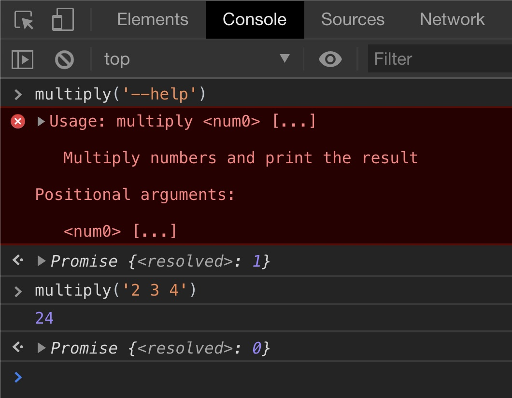

## Usage

Install this library using `npm`:

```plaintext
npm install @carnesen/cli
```

Here is a TypeScript Node.js CLI that does some basic arithmetic:

```typescript
// src/multiply.ts

// The "c" export is a compact API sufficient for most CLIs
import { c } from '@carnesen/cli';

// This CLI has just one command
const multiplyCommand = c.command({
   name: 'multiply',
   description: 'Multiply numbers and print the result',
   positionalArgGroup: c.numberArray(),
   action({ positionalValue: numbers }) {
      return numbers.reduce((a, b) => a * b, 1);
   },
});

// Export for unit testing
export const cli = c.cli(multiplyCommand);

if (require.main === module) {
   // This module is the entrypoint for this Node.js process
   cli.run();
}
```

Here's how that Node.js CLI behaves in a terminal:
<p></p>

The only Node.js-specific code is the `if (require.main === module)` block. To instead make a web browser console CLI, replace that with:

```typescript
(window as any).multiply = (line: string) => {
   cli.runLine(line);
};
```

Here's that CLI in a JavaScript console:
<p></p>

The resolved value of `0` means the command finished successfully. A non-zero exit code means an error occurred. Try it you yourself at [cli.carnesen.com](https://cli.carnesen.com)! Here's how to open the console in [Firefox](https://developer.mozilla.org/en-US/docs/Tools/Web_Console/Opening_the_Web_Console) and [Google Chrome](https://stackoverflow.com/a/66434/2793540).

## Structure

The general structure of a `@carnesen/cli` command line is:
```
<command group> <command> \
   <positional args> \
   --<named arg group name> <args> \
   -- <double dash args>
```
Only `<command>` is required. This section of the documentation describes each of these pieces in more detail.

### Command

A command defines an `action` function together with its command-line arguments. For example, in `cloud users list`, the command is `list`. Some commands don't have any arguments. For example:

```typescript
import { c } from '@carnesen/cli';

export const listUsersCommand = c.command({
   name: 'list',
   async action() {
      // Code here to fetch and return all users ...
   }
})
```
[[`c.command`]] is an alias for [[`CCliCommand.create`]], a factory function that returns a [[`CCliCommand`]].

Most commands declare arguments through the `positionalArgGroup`, `namedArgGroups`, and/or `doubleDashArgGroup` properties as described below.

### Command group

You can use command groups to organize the commands in your CLI. For example, in `cloud users list`, `cloud` and `users` are command groups. Command groups are optional. Organize your CLI to suit your needs and taste:

- `list-cloud-users`: No command groups
- `cloud list-users`: A single command group
- `cloud users list`: A hierarchical command tree

```typescript
import { c } from '@carnesen/cli';
import { listUsersCommand } from './list-users-command';

export const usersCommandGroup = c.commandGroup({
   name: 'users',
   subcommands: [ listUsersCommand ]
})

export const rootCommandGroup = c.commandGroup({
   name: 'cloud',
   subcommands: [ usersCommandGroup ]
})
```

[[`c.commandGroup`]] is an alias for [[`CCliCommandGroup.create`]], a factory function that returns a [[`CCliCommandGroup`]].

### Argument group

An _argument group_ declares a collection of zero or more consecutive command-line arguments parsed together as a single well-typed value. In the example "multiply 1 2 3", the `c.numberArray` arg group receives strings from the command-line `["1", "2", "3"]` and parses a `number[]` value `[1, 2, 3]`. Argument groups require at least one argument unless they're configured with `optional: true` in which case zero arguments is OK and the parsed value type includes `| undefined`. The `@carnesen/cli` package provides argument group factories for many parsed value types (`bigint`, `bigint[]`, `boolean`, `number`, `number[]`, `string`, `string[]`, `unknown` (JSON)), but you can also define your own custom argument group types by extending `CCliArgGroup`.

### Positional arguments

A command's `positionalArgGroup` receives all the command-line arguments after the command but before the first argument that starts with `--`. For example, in `cloud users delete carl karen --force`, the positional arguments are `carl` and `karen`. The argument group's parsed value is the `positionalValue` property of the action input:

```typescript
import { c } from '@carnesen/cli';

export const deleteCommand = c.command({
   name: 'delete',
   positionalArgGroup: c.stringArray(),
   async action({ positionalValue: usernames }) {
      // ^^ `usernames` is typed `string[]`
      //
      // If we had provided `{optional: true}` to `c.stringArray()`,
      // `usernames` would be typed `string[] | undefined`
      //
      // Code here to delete the users ...
   }
})
```

### Named arguments

A command's `namedArgGroups` declares argument groups that receive arguments preceded by a named argument group separator `--name`. For example in `cloud users delete karen --force`, `--force` is a named argument group separator with no subsequent arguments. The `force` named argument group receives `undefined` (no argument provided). The parsed values are passed into the command's `action` as a property `namedValues` of shape `{ <name>: <parsed value>, ... }`. Here's an example adding a command-line flag to `cloud users list`:

```typescript
import { c } from '@carnesen/cli';

export const listCommand = c.command({
   name: 'list',
   namedArgGroups: {
      active: c.flag({
         description: "If passed, only list active users",
      }),
   },
   async action({ namedValues: { active } }) {
      // `active` is true` if --active was passed 
      // or `false` otherwise
      // 
      // Code here to fetch the users ...
   }
})
```

### Double-dash arguments

All command-line arguments after a lone argument `--` (the double-dash argument group separator argument) are passed to the command's `doubleDashArgGroup`. After the lone `--`, things like `--name` aren't interpreted as named argument group separators. This is particularly useful for passing arguments through to another program. Suppose we make a CLI for executing commands on a remote system. We might try a command line like `exec-remote git --version`. The problem there is that `@carnesen/cli` interprets `--version` as a named argument group separator. Instead we want to treat it just as a string that gets passed to the `git` command on the remote system. Inspired by [npm run-script](https://docs.npmjs.com/cli/v9/commands/npm-run-script), we'll instead have the user do `exec-remote -- git --version`. The `doubleDashArgGroup`'s `action` receives the parsed double-dash arguments as `doubleDashValue`:

```typescript
import { c } from '@carnesen/cli';

export const doCommand = c.command({
   name: 'do',
   doubleDashArgGroup: c.stringArray(),
   async action({ doubleDashValue: args }) {
      // Code here to do stuff ...
   }
})
```

### Error handling

By default, `@carnesen/cli` `console.error`'s the full exception thrown by the `action` function or argument parser, stack trace and all. Two special error objects have non-default handling:

- `CCliUsageError`: Throw this if you want to print the selected command's usage and exit without showing a stack trace. This is useful for defining custom argument parsers.
- `CCliTerseError`: Throw this if you want to prints the object's `message` and exit without showing a stack trace

In any case, the command runner exits (returns) a non-zero numeric status code (`1`) or the thrown exception's `exitCode` if it's a number. `CCliTerseError`'s second argument is `exitCode`.

[Go back to top](#)
