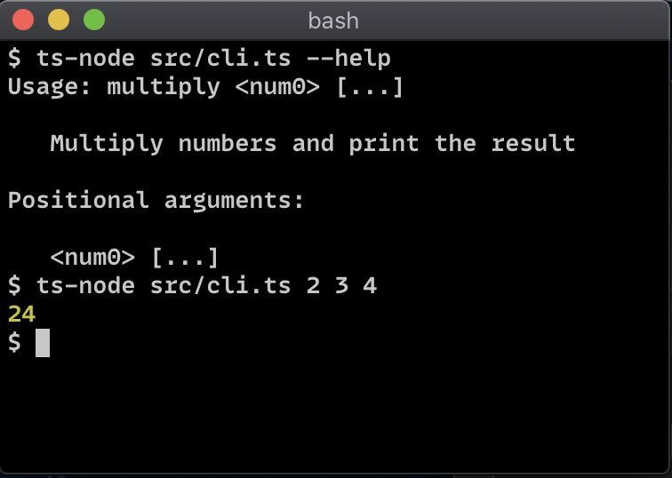

## Usage

Install this library using `npm`:

```plaintext
npm install @carnesen/cli
```

Here is a TypeScript Node.js CLI that does some basic arithmetic:

```typescript
// src/multiply.ts
import { c } from '@carnesen/cli';

const multiplyCommand = c.command({
   name: 'multiply',
   description: 'Multiply numbers and print the result',
   positionalArgGroup: c.numberArray(),
   action({ positionalValue: numbers }) {
      return numbers.reduce((a, b) => a * b, 1);
   },
});

// Export for unit testing
export const cli = c.cli(multiplyCommand);

// If this module is the entrypoint for this Node.js process
if (require.main === module) {
   cli.run();
}
```

Here's how that Node.js CLI behaves in a terminal:
<p></p>

The only Node.js-specific code is the `if (require.main === module)` block. To instead make a web browser console CLI, replace that with:

```typescript
(window as any).multiply = (line: string) => {
   cli.runLine(line);
};
```

Here's that CLI in a JavaScript console:
<p></p>

The resolved value of `0` means the command finished successfully. A non-zero exit code means an error occurred. Try it you yourself at [cli.carnesen.com](https://cli.carnesen.com)! Here's how to open the console in [Firefox](https://developer.mozilla.org/en-US/docs/Tools/Web_Console/Opening_the_Web_Console) and [Google Chrome](https://stackoverflow.com/a/66434/2793540).

## Structure

The general structure of a `@carnesen/cli` command line is:
```
<command group> <command> \
   <positional args> \
   --<named arg group name> <args> \
   -- <double dash args>
```
Only `<command>` is required. This section of the documentation describes each of these pieces in more detail.

### Command

A command defines an action `function` or `async function` together with its command-line arguments. For example, in `cloud users list`, the command is `list`. Some commands don't have any arguments. For example:

```typescript
import { c } from '@carnesen/cli';

export const listUsersCommand = c.command({
   name: 'list',
   async action() {
      // Fetch all users
   }
})
```
[[`c.command`]] is an alias for [[`CCliCommand.create`]], a factory function that returns a [[`CCliCommand`]].

Most commands define arguments through the `positionalArgGroup`, `namedArgGroups`, and/or `doubleDashArgGroup` properties as described below.

### Command group

You can use command groups to organize the commands in your CLI. For example, in `cloud users list`, `cloud` and `users` are command groups and `list` is a command. Command groups are optional. Organize your CLI to suit your needs and taste:

- `list-cloud-users`: No command groups
- `cloud list-users`: A single command group
- `cloud users list`: A hierarchical command tree

```typescript
import { c } from '@carnesen/cli';
import { listUsersCommand } from './list-users-command';

export const usersCommandGroup = c.commandGroup({
   name: 'users',
   subcommands: [ listUsersCommand ]
})

export const rootCommandGroup = c.commandGroup({
   name: 'cloud',
   subcommands: [ usersCommandGroup ]
})
```

[[`c.commandGroup`]] is an alias for [[`CCliCommandGroup.create`]], a factory function that returns a [[`CCliCommandGroup`]].

### Positional arguments

A command's `positionalArgGroup` receives all the command-line arguments after the command but before the first argument that starts with `--`. For example, in `cloud users delete carl karen --force`, the positional arguments are `carl` and `karen`. The argument group's parsed value is the `positionalValue` property of the action input:

```typescript
import { c } from '@carnesen/cli';

export const deleteCommand = c.command({
   name: 'delete',
   positionalArgGroup: c.stringArray(),
   async action({ positionalValue: usernames }) {
      // The CliStringArrayArgGroup parser returns an array of strings e.g.
      //   ["carl", "karen"]
      // Delete the users ...
   }
})
```

By default, the [[`CCliStringArrayArgGroup`]] parser throws a [[`CCliUsageError`]] when no argument is provided. If `optional == true` and no argument is provided, `positionalValue` is `undefined`.

### Named arguments

A command's `namedArgGroups` receives all the command-line arguments of the form `--name value`. The parsed values are passed into the command's action as a property called `namedValues` of shape `{ name: <value>, ... }`. For example, in `cloud users list` let's add a command-line flag to filter out inactive users:

```typescript
import { c } from '@carnesen/cli';

export const listCommand = c.command({
   name: 'list',
   namedArgGroups: {
      active: c.flag(),
   },
   async action({ namedValues: { active } }) {
      // CliFlagArgGroup returns false unless --active was passed
      // Fetch the users ...
   }
})
```

### Double-dash arguments

All command-line arguments after a lone `--` are passed to the command's `doubleDashArgGroup`. After the lone `--`, things like `--name` aren't interpreted as argument group separators. This is particularly useful for passing arguments through to another CLI like `do -- git --version`. The argument group's return value is the `doubleDashValue` property of the action's input:

```typescript
import { c } from '@carnesen/cli';

export const doCommand = c.command({
   name: 'do',
   doubleDashArgGroup: c.stringArray(),
   async action({ doubleDashValue: args }) {
      // Do stuff ...
   }
})
```

### Error handling

By default, `@carnesen/cli` `console.error`'s the full exception thrown by the `action` function or argument parser, stack trace and all. Two special error objects have non-default handling:

- `CCliUsageError`: Throw this if you want to print the selected command's usage and exit without showing a stack trace. This is useful for defining custom argument parsers.
- `CCliTerseError`: Throw this if you want to prints the object's `message` and exit without showing a stack trace

In any case, the command runner exits (returns) a non-zero numeric status code (`1`) or the thrown exception's `exitCode` if it's a number. `CCliTerseError`'s second argument is `exitCode`.

[Go back to top](#)
