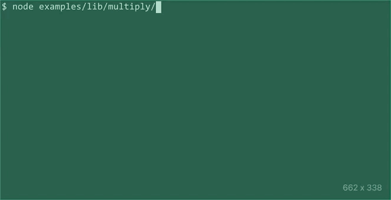

# @carnesen/cli
Command-line interfaces for Node.js and the browser

[](https://www.npmjs.com/package/@carnesen/cli) [](https://github.com/carnesen/cli/actions?query=workflow%3Atest+branch%3Amaster)

The @carnesen/cli package includes runtime JavaScript files for Node.js >=v10 and type declarations for TypeScript >=v3.8. API documentation is available on the web at [cli.carnesen.com/docs](https://cli.carnesen.com/docs). This library has _no_ dependencies, so it works in a browser too! Check out [the live online examples](https://cli.carnesen.com).

## Stability
This library has 99% test coverage and heavy usage by its author but should be considered 0.x beta software.

## Usage
Install this package as a dependency of your project using `npm`:

```
npm install @carnesen/cli
```

Here is [a CLI](examples/src/multiply/index.ts) that does some basic arithmetic:

```typescript
// examples/src/multiply/index.ts
import {
	Cli,
	CliCommand,
	CliNumberArrayArgGroup,
	runCliAndExit,
} from '@carnesen/cli';

const multiply = CliCommand({
	name: 'multiply',
	description: 'Multiply numbers and print the result',
	positionalArgGroup: CliNumberArrayArgGroup({
		required: true,
	}),
	action(numbers) {
		return numbers.reduce((a, b) => a * b, 1);
	},
});

if (require.main === module) {
	runCliAndExit(Cli(multiply));
}
```
Here's how that behaves as a CLI.



Check out [examples/src](examples/src) and [cli.carnesen.com](https://cli.carnesen.com) for more examples.

## More information
If you have questions, encounter bugs, or would like to request a feature, please don't hesitate to file an issue or submit a pull request on [this project's repository on GitHub](https://github.com/carnesen/cli).

## License
MIT © [Chris Arnesen](https://www.carnesen.com)
