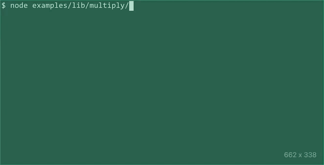

# @carnesen/cli
A TypeScript-first framework for building command-line interfaces in Node.js

[](https://www.npmjs.com/package/@carnesen/cli) [](https://github.com/carnesen/cli/actions?query=workflow%3Atest+branch%3Amaster)

The `@carnesen/cli` package includes runtime JavaScript files for Node.js >=10 and strict `.d.ts` type declarations. API documentation is available on the web at [https://cli.carnesen.com/](https://cli.carnesen.com/).

## Stability
This library has 98% test coverage and years of use, but it should still be considered 0.x beta software.

## Usage
Install this package as a dependency of your project using `npm`:

```
npm install @carnesen/cli
```

Here is [a CLI](examples/src/multiply/index.ts) that does some basic arithmetic:

```typescript
// examples/src/multiply/index.ts
import {
  CliCommand,
  CliNumberArrayValuedParser,
  runCliAndExit
} from '@carnesen/cli';

export const multiply = CliCommand({
  name: 'multiply',
  description: 'Multiply numbers and print the result',
  positionalValuedParser: CliNumberArrayValuedParser({ required: true }),
  action(numbers) {
    return numbers.reduce((a, b) => a * b, 1);
  },
});

if (require.main === module) {
  runCliAndExit(multiply);
}
```
Here's how that behaves as a CLI.



Check out [examples/src](examples/src) for more examples.

## Structure
The general structure of a `@carnesen/cli` is:
```
<branch> <command> <positional-args> --name <named-args> -- <escaped-args>
```
Only `<command>` is required.

## More information
If you have questions, encounter bugs, or would like to request a feature, please don't hesitate to file an issue or submit a pull request on [this project's repository on GitHub](https://github.com/carnesen/cli).

## License
MIT © [Chris Arnesen](https://www.carnesen.com)
